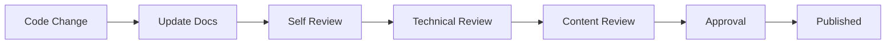

# CropFresh Farmers App Documentation

Welcome to the comprehensive documentation for the CropFresh Farmers App. This documentation covers all aspects of the application from implementation details to deployment procedures.

## 📚 Documentation Index

### 🚀 Getting Started

- **[Documentation Standards](DOCUMENTATION_STANDARDS.md)** - Guidelines for writing and maintaining documentation
- **[Setup Guide](../SETUP_GUIDE.md)** - Initial project setup and development environment

### 📱 Features Documentation

- **[Splash Screen](features/SPLASH_SCREEN.md)** - 3D animated splash screen with logo integration
- **[Onboarding Flow](features/ONBOARDING.md)** - 4-screen onboarding experience with animations
- **[Authentication](features/AUTHENTICATION.md)** - User authentication and security *(Coming Soon)*
- **[Marketplace](features/MARKETPLACE.md)** - Direct farmer-to-buyer marketplace *(Coming Soon)*
- **[Farm Management](features/FARM_MANAGEMENT.md)** - Complete farm solution tools *(Coming Soon)*

### 🏗️ Architecture Documentation

- **[System Overview](architecture/OVERVIEW.md)** - High-level architecture and design patterns *(Coming Soon)*
- **[Data Flow](architecture/DATA_FLOW.md)** - Data movement and state management *(Coming Soon)*
- **[Design Patterns](architecture/DESIGN_PATTERNS.md)** - Architectural patterns used in the app *(Coming Soon)*

### 🎨 Design Documentation

- **[Color Scheme](design/COLOR_SCHEME.md)** - 60-30-10 color rule implementation *(Coming Soon)*
- **[Typography](design/TYPOGRAPHY.md)** - Font usage and text styling *(Coming Soon)*
- **[Component Library](design/COMPONENT_LIBRARY.md)** - Reusable UI components *(Coming Soon)*

### 🔌 API Documentation

- **[REST API](api/REST_API.md)** - Backend API endpoints and specifications *(Coming Soon)*
- **[Authentication API](api/AUTHENTICATION.md)** - Auth endpoints and security *(Coming Soon)*

### 🚢 Deployment Documentation

- **[Development Setup](deployment/DEVELOPMENT.md)** - Local development environment *(Coming Soon)*
- **[Staging Deployment](deployment/STAGING.md)** - Staging environment setup *(Coming Soon)*
- **[Production Deployment](deployment/PRODUCTION.md)** - Production deployment procedures *(Coming Soon)*

## 🔧 Current Implementation Status

### ✅ Completed Features

#### Splash Screen (v1.2.0)
- **Duration**: 5 seconds with automatic navigation
- **Animations**: 3D logo rotation, floating particles, shimmer effects
- **Assets**: Real CropFresh logo.png integration
- **Navigation**: Smooth transition to onboarding

#### Onboarding Flow (v1.2.0)
- **Screens**: 4-screen comprehensive introduction
  1. Welcome to CropFresh
  2. Marketplace Features
  3. Complete Farm Solution  
  4. Language Selection (Kannada, Telugu, Hindi, English)
- **Animations**: Staggered animations with `flutter_staggered_animations`
- **Responsive**: Optimized for both phone and tablet layouts
- **Navigation**: Skip functionality and progress indicators

### 🚧 In Development

- Authentication system
- Main dashboard
- Marketplace features
- Farm management tools

## 📖 Quick Reference

### Color Scheme (60-30-10 Rule)

```dart
// 60% - Background colors (Dominant)
CropFreshColors.background60Primary     // Light cream
CropFreshColors.background60Secondary   // Soft variations
CropFreshColors.warm60Light            // Warm tones

// 30% - Green colors (Secondary)  
CropFreshColors.green30Primary         // Main brand green
CropFreshColors.green30Fresh           // Fresh green variants
CropFreshColors.green30Forest          // Deeper green tones

// 10% - Orange accents (Accent)
CropFreshColors.orange10Primary        // Call-to-action orange
CropFreshColors.orange10Light          // Light orange tones
```

### Navigation Flow

```
App Launch → Splash Screen (5s) → Onboarding (4 screens) → Main Dashboard
```

### File Structure

```
lib/
├── core/                   # Core utilities and constants
│   ├── constants/         # Colors, dimensions, strings
│   ├── theme/            # App theming
│   └── utils/            # Utility functions
├── features/             # Feature-based organization
│   ├── splash/           # Splash screen feature
│   ├── onboarding/       # Onboarding flow feature
│   ├── auth/            # Authentication (coming soon)
│   └── marketplace/     # Marketplace (coming soon)
├── shared/              # Shared widgets and utilities
│   └── widgets/         # Reusable widgets
└── main.dart           # App entry point
```

## 🛠️ Development Guidelines

### Code Standards

- **Comments**: Use Better Comments system with color-coded annotations
- **Architecture**: Follow feature-based folder structure
- **Naming**: Use descriptive names following Dart conventions
- **Documentation**: Document all public APIs and complex logic

### Animation Guidelines

- **Duration**: Keep individual animations under 1 second
- **Staggering**: Use 100-200ms delays between elements
- **Performance**: Monitor 60fps performance on target devices
- **Accessibility**: Respect reduced motion preferences

### Testing Strategy

- **Unit Tests**: 70% of test coverage
- **Integration Tests**: 20% of test coverage  
- **End-to-End Tests**: 10% of test coverage
- **Manual Testing**: Device-specific UI/UX validation

## 📞 Support and Contributing

### Getting Help

1. **Check Documentation**: Search existing docs first
2. **Code Comments**: Review in-code Better Comments
3. **Team Discussion**: Reach out to development team
4. **Issue Tracking**: Create detailed issue reports

### Contributing to Documentation

1. **Follow Standards**: Use established documentation template
2. **Test Examples**: Verify all code examples work
3. **Review Process**: Submit for technical and content review
4. **Keep Updated**: Maintain documentation with code changes

### Documentation Workflow



## 🔄 Version History

| Version | Date | Changes |
|---------|------|---------|
| 1.0.0 | Dec 2024 | Initial documentation structure |
| 1.1.0 | Dec 2024 | Added splash screen documentation |
| 1.2.0 | Dec 2024 | Added onboarding flow documentation |

## 📋 TODO

### High Priority
- [ ] Complete authentication documentation
- [ ] Add marketplace feature documentation
- [ ] Create architecture overview diagrams
- [ ] Document API specifications

### Medium Priority
- [ ] Add component library documentation
- [ ] Create deployment guides
- [ ] Add performance optimization guide
- [ ] Document testing strategies

### Low Priority  
- [ ] Add video tutorials
- [ ] Create interactive documentation
- [ ] Add multi-language documentation
- [ ] Create troubleshooting guides

---

**Last Updated**: December 2024  
**Maintainer**: CropFresh Development Team  
**Repository**: [CropFresh Farmers App](https://github.com/cropfresh/farmers-app) 